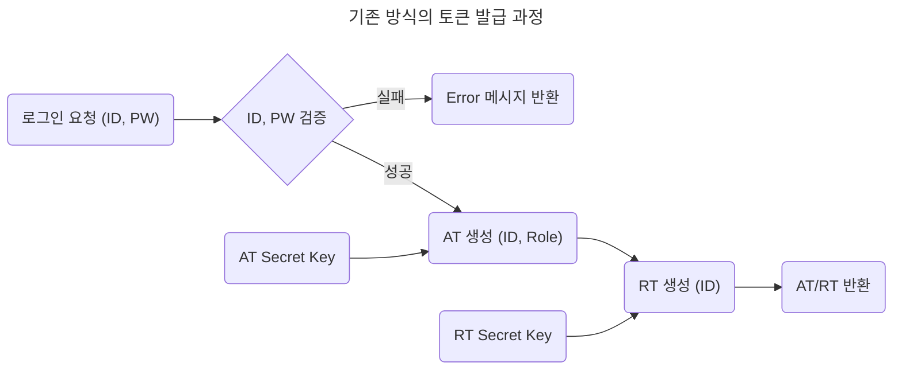
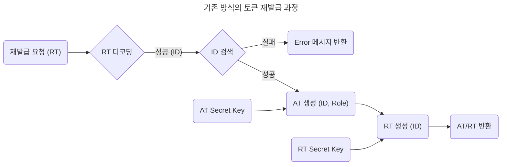
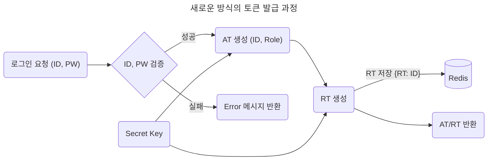
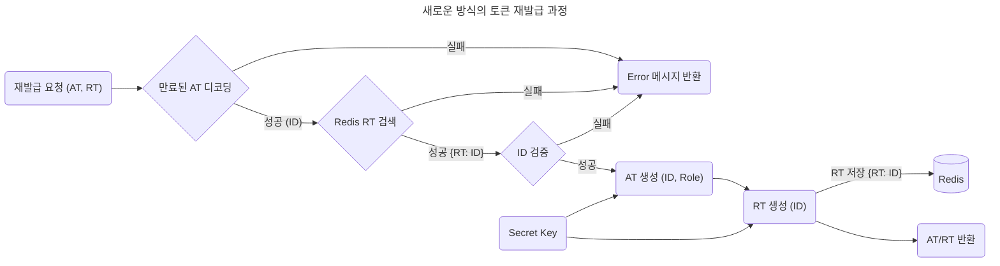

	<h1>Spring Auth</h1>
	

		<b>JWT(Json Web Token) 기반 인증 시스템 구축</b>
	

	 

> [!NOTE]
> 프로젝트의 목표는 기존과 다른 방식으로 JWT (Json Web Token) 기반 인증 시스템을 구축하는 것이다.

## 🔐 인증 구현 방식

### 1. 기존 방식

- AT (Access Token) / RT (Refresh Token) 모두 클라이언트에서 저장 및 관리
- AT와 RT 각각 다른 **Secret Key**로 생성

### 2. 새로운 방식

- AT는 클라이언트에서 저장 및 관리
- RT는 클라이언트와 서버에서 저장 및 관리
- AT와 RT 같은 **Secret Key**로 생성

